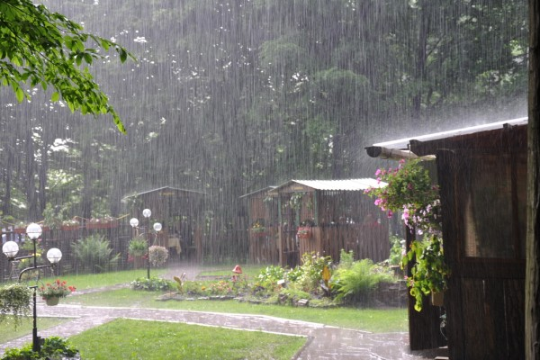

# Weather Report App 🌦️

A sleek and interactive weather application that provides real-time weather information and forecasts.

## Live Demo 🌐

[Weather Report App Live](https://skystate-app.netlify.app)

## Features ✨

- **Real-time Weather Data**: Get current weather conditions for any city
- **5-Day Forecast**: View weather predictions for the next 5 days
- **Geolocation Support**: Get weather data for your current location
- **Temperature Unit Toggle**: Switch between Celsius and Fahrenheit
- **Dynamic Weather Backgrounds**: Background changes based on weather conditions
- **Weather Fun Facts**: Interesting weather-related facts that rotate periodically
- **Weather Suggestions**: Helpful tips based on current weather conditions

## Technologies Used 🛠️

- HTML5
- CSS3
- JavaScript (ES6+)
- OpenWeatherMap API
- Netlify (Hosting)

## Screenshots 📸




## API Integration 🔑

This project uses the [OpenWeatherMap API](https://openweathermap.org/api) to fetch weather data. The API key is included in the code as it's a free tier key.

## Local Development 💻

1. Clone the repository:
```bash
git clone https://github.com/freez-dhanush/weather-now-app.git
```

2. Navigate to the project directory:
```bash
cd weather-now-app
```

3. Open `index.html` in your browser

## Project Structure 📁

```
weather-now-app/
│
├── index.html          # Main HTML file
├── style.css          # Styles
├── script.js          # JavaScript functionality
│
└── images/            # Weather background images
    ├── clear.jpg
    ├── clouds.jpg
    ├── rain.jpg
    ├── snow.jpg
    ├── thunderstorm.jpg
    ├── mist.jpg
    ├── haze.jpg
    ├── drizzle.jpg
    ├── fog.jpg
    ├── default.jpg
    └── error.jpg
```

## Features in Detail 🔍

- **Current Weather Display**:
  - Temperature
  - Humidity
  - Wind Speed
  - Weather Description
  - Weather Icon

- **5-Day Forecast**:
  - Daily Temperature
  - Weather Icons
  - Day of the Week

- **Dynamic UI Elements**:
  - Weather-based backgrounds
  - Smooth transitions
  - Responsive design
  - Interactive cards

## Author ✍️

- **Dhanush** - [GitHub Profile](https://github.com/freez-dhanush)

## Last Updated 📅

2025-06-10 09:52:48 UTC

## License 📝

This project is open source and available under the [MIT License](LICENSE).
